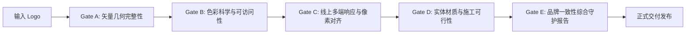

# 05. 品牌守护者审计体系与五道质量门禁 (Brand Guardian Audit & Quality Gates)

为杜绝任何低质量变形、色差偏离、对比度不足或空间施工安全隐患，本技能内置了严苛的 **Brand Guardian 品牌守护者审查体系**，由五道串联式质量门禁（Gate A – Gate E）严格把关。

---

## 🚦 五道质量门禁流 (Quality Gates A–E)

### 1. Gate A：矢量几何与清晰度门禁 (Geometry & Resolution Gate)
- **审查项**:
  - Logo 图像分辨率是否满足最小 300DPI 打印或矢量 SVG 无损渲染；
  - 核心符号轮廓是否平滑，有无锯齿毛刺与隐性压缩噪点；
  - 是否具备明确的长宽比（Aspect Ratio）与 0.5X 安全隔离区定义；
- **通过标准**: 分辨率 >= 800x800 或原始 SVG 矢量无破损路径。

### 2. Gate B：色彩科学与无障碍对比度门禁 (Color & Accessibility Gate)
- **审查项**:
  - 核心主色是否在白底和黑底上均经过 WCAG 2.1 AA 级对比度认证；
  - 关键操作按钮和文字是否达到 `>= 4.5:1` 对比度；
  - CMYK 四色分色总和是否控制在 300% 以内，杜绝印刷油墨粘连反粘；
- **通过标准**: 若对比度不足，必须强制启用防眩光半透明胶囊底托（Anti-Glare Capsule）。

### 3. Gate C：线上多端响应与像素网格对齐门禁 (Digital & Pixel Grid Gate)
- **审查项**:
  - App Icon 在 1024pt、180pt、60pt 及 16pt Favicon 微缩状态下，核心超级符号是否仍然高度可辨；
  - CSS Tokens 是否完整定义 Light / Dark 双模态映射；
  - 网页组件是否存在文字折行溢出或容器截断；
- **通过标准**: 多端图标在极限微缩（16px）下无重影粘连，tokens.css 语法完全符合 W3C 规范。

### 4. Gate D：实体空间与工艺施工可行性门禁 (Physical Feasibility Gate)
- **审查项**:
  - 门头与前台立体发光字最小笔画宽度是否 `>= 15mm`（低于 15mm 无法塞入 LED 发光模组与背光底板）；
  - 玻璃腰线高度（200mm）与中心线距地（1200mm）是否符合国家建筑防撞安全标准；
  - 易拉宝展架重要信息（如二维码、核心卖点）是否处于人眼自然平视区（900mm-1700mm），严禁贴近地面；
- **通过标准**: 施工材质、灯光色温（3000K-4000K）与物理固定结构完全符合广告工程规范。

### 5. Gate E：品牌一致性全域综合守护报告 (Comprehensive Audit Scorecard)
- **审查项**:
  - 线上与线下 10 大核心触点的超级符号演进是否具备一致的几何血统；
  - 品牌主调性是否与商业愿景高度吻合；
- **通过标准**: 品牌守护合规评分达到 **90 分以上（满分 100 分）** 即可归档并输出交付包。
